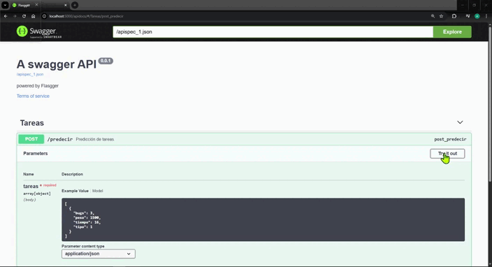

# pg-saffiro backend ai API



This API is part of the **pg-saffiro** project, which also includes the following repositories (Esta API forma parte del proyecto pg-saffiro, el cual incluye además los siguientes repositorios):
- [Saffiro-frontend](https://github.com/AlfreGonzales/pg-saffiro-frontend)
- [Saffiro-backend](https://github.com/AlfreGonzales/pg-saffiro-backend)

---

This is an API developed with the **Flask** framework in **Python**. It has a single endpoint that receives an array of objects (representing task characteristics), each containing four parameters. For each object, a floating point value between 1 and 10 is returned to determine the priority, with 1 being the lowest priority and 10 being the highest. This API interacts with a machine learning model that was trained with historical data from the company, making it possible to predict the priority of each task based on its characteristics.

You can see the development of the machine learning model at the following link: [Machine learning model](https://colab.research.google.com/drive/1Sxe5GVyMCV23tm2_iqU8G3rIuXsVzlfr?usp=sharing)

## ▶️ How to execute the project

```bash
pip3 install --no-deps -r requirements.txt
py app.py
```

Once you have executed the above commands, go to the following link: <http://localhost:5000/apidocs/>

## 📄 License

[MIT License](LICENSE)

---

Esta es una API desarrollada con el framework **Flask** en **Python**, cuenta con un solo endpoint el cual recibe un arreglo de objetos (que representan caracteristicas de tareas) los cuales contienen 4 parametros cada uno, y, por cada objeto, se devuelve un valor númerico flotante del 1 al 10 para determinar la prioridad, siendo 1 la menos prioritaria y 10, la más. Esta API interactua con un modelo de machine learning que fue entrenado con datos históricos de la empresa, por lo tanto es posible predecir la prioridad de cada dada sus caracteristicas.

Se puede ver el desarrollo del modelo de machine learning en el siguiente enlace:
[Modelo de machine learning](https://colab.research.google.com/drive/1Sxe5GVyMCV23tm2_iqU8G3rIuXsVzlfr?usp=sharing)

## ▶️ Cómo ejecutar el proyecto

```bash
pip3 install --no-deps -r requirements.txt
py app.py
```

Una vez ejecutados los comandos anteriores, dirigirse al siguiente enlace:
<http://localhost:5000/apidocs/>

## 📄 Licencia

[Licencia del MIT](LICENSE)
